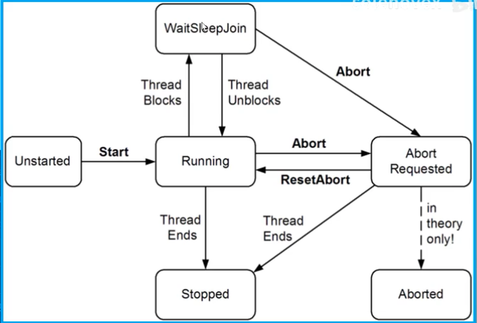

# 阻塞Blocking
<ul>
    <li>如果线程的执行由于某种原因导致暂停,那么就认为该线程被阻塞了</li>
    <ul>
        <li>例如在Sleep或者通过Join等待其它线程结束</li>
    </ul>
    <li>被阻塞的线程会立即将其处理器的时间片生成给其它线程,从此就不再消耗处理器时间，直到满足其阻塞条件为止</li>
    <li>可以通过ThreadSafe这个属性来判断线程是否处于被阻塞的状态:</li>
    <ul>
        <li>bool blocked = (someThread.ThreadState & ThreadState.WaitSleepJoin) != 0;</li>
        <li>ThreadState是个flag枚举,是可能有多个枚举值</li>
        <li></li>
    </ul>
</ul>

### ThreadState
<ul>
    <li>ThreadState是一个flags enum,通过按位的形式,可以合并数据的选项</li>
    <li>[Official Document](https://docs.microsoft.com/en-us/dotnet/api/system.threading.threadstate?view=net-5.0)ThreadState</li>
    <li>大部分枚举值都没用，最有用的四个:</li>
    <ul>
        <li>Unstarted</li>
        <li>Running</li>
        <li>WaitSleepJoin</li>
        <li>Stopped</li>
    </ul>
    <li>ThreadState属性可以用于诊断目的,但不适合用于同步.因为线程状态可能会在测试ThreadState和对该信息进行操作之间发生变化</li>
</ul>

### 解除阻塞Unblocking
<ul>
    <li>当遇到以下四种情况时候,就会解除阻塞:</li>
    <ul>
        <li>阻塞条件被满足</li>
        <li>操作超时</li>
        <li>通过Thread.Interrupt()进行打断</li>
        <li>通过Thread.Abort()进行中止</li>
    </ul>
</ul>

### 上下文切换
<ul>
    <li>当线程阻塞或者解除阻塞时,操作系统将执行上下文切换。</li>
    <li>这样会产生少量开销,通常为1或者2微秒</li>
</ul>

### I/O-bound vs Compute-bound (CPU-bound)
<ul>
    <li>一个花费大部分时间等待某事发生的操作称之为I/O-bound</li>
    <ul><li>I/O绑定操作通常涉及输入或输出,但这不是硬性要求:Thread.Sleep()也被视为I/O-bound</li></ul>
    <li>一个花费大部分时间执行CPU密集型工作的操作被称为Compute-bound</li>
</ul>

### 阻塞Blocking vs忙等待(自旋)Spinning
<ul>
    <li>I/O-bound操作的工作方式有两种:<li>
    <ul>
        <li>在当前线程上同步的等待</li>
        <ul>
            <li>Console.ReadLine()</li>
            <li>Thread.Sleep()</li>
            <li>Thread.Join()</li>
        </ul>
        <li>异步的操作,在稍后操作完成时出发一个回调动作</li>
    </ul>
    <li>同步等待的I/O-bound操作将大部分时间花在阻塞线程上</li>
    <li>它们也可以周期性地在一个循环里进行"打转(自旋)"。例如:</li>
    <ul>
    <li>while(DateTime.Now < nextStartTime);</li>
    <li>while(DateTime.Now < nextStartTime) Thread.Sleep(100);</li>
    </ul>
    <li>在忙等待和阻塞方面还是有一些细微的差异:</li>
        <ul>
            <li>如果预期条件很快得到满足(可能在几微秒之内),则短暂自旋可能会很有效,因为它避免了上下文切换的开销和延迟</li>
            <ul>
                <li>.NET Framework提供了特殊的方法和类来提供帮助SpinLock和SpinWait</li>
            </ul>
            <li>阻塞并不是零成本。因为每个线程在生存期间会占用大约1MB的内存,并会给CLR和操作系统带来持续的管理开销</li>
            <ul>
                <li>在处理大规模并发I/O-bound程序的上下文中,阻塞可能会很麻烦。</li>
                <li>这时候需要使用基于回调的方法,在等待时完全撤销其线程。</li>
            </ul>
        </ul>
</ul>